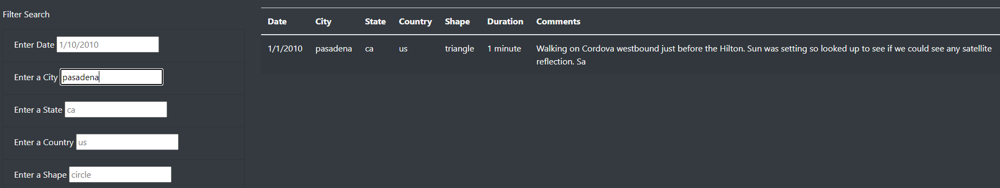

# UFOs
You can find the analysis files here: [app.js](https://github.com/NedaAJ/UFOs/blob/main/statics/js/app.js) | [index.html](https://github.com/NedaAJ/UFOs/blob/main/index.html)

## Overview of Analysis
The purpose of this analysis is to construct a webpage with a **dynamic table** that displays the **filtered UFO sightings data**. Users could only utilise a date filter on the first webpage that was created. However, for this project, we want to give consumers the option of filtering the data using criteria other than the date. The table will have other filters such as *city, state, country, and shape*.
## Results
Previously, the webpage merely included a date filter that could be applied by clicking a button. Users can now filter data by entering a criteria into one of the filter areas in the new upgraded version. The table will then be automatically filtered so that only relevant information is displayed on the webpage. The table is shown without any filters in the first image. In the text box, users may see the format that the filter requires to work. The table will filter the results based on the information visitor provide.

## Summary of Analysis
One disadvantage of this webpage is that it cannot yet be resized to fit the device on which it is being read. When the user magnifies the webpage, some elements, such as the image, can resize, but the webpage as a whole cannot. As a result, adding formatting that changes the sections and margins when the page is viewed on a mobile device or tablet is one suggestion for future improvement.
A survey form is another element that may be introduced to the webpage. The users' experience with intergalactic sightings would be questioned in the poll. It can include questions like a description of what they saw, the length of time they saw it, the overall geographic location, and other noteworthy data. By doing so, we can add fresh user sightings to our table and database.

## Contact:
- Email : [neda.ahmadi.jesh@gmail.com](mailto:neda.ahmadi.jesh@gmail.com?subject=[GitHub]%20Source%20Han%20Sans)
- Linkedin: www.linkedin.com/in/neda-ahmadi-j
